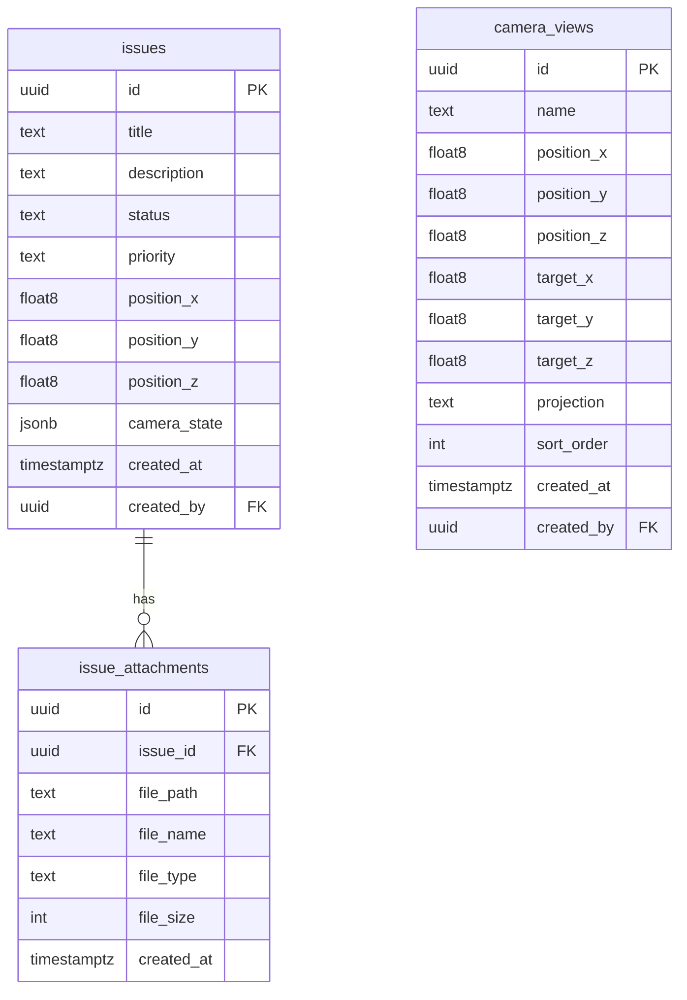

# 建設DXツール インフラ構築ガイド

本ガイドでは、Supabaseを使用したバックエンド環境の構築手順を説明します。

---

## 目次

1. [前提条件](#1-前提条件)
2. [Supabaseプロジェクト作成](#2-supabaseプロジェクト作成)
3. [データベース構築](#3-データベース構築)
4. [ストレージ設定](#4-ストレージ設定)
5. [環境変数設定](#5-環境変数設定)
6. [接続テスト](#6-接続テスト)
7. [トラブルシューティング](#7-トラブルシューティング)
8. [デザイン仕様との連携](#8-デザイン仕様との連携)
9. [既知の問題と推奨アクション](#9-既知の問題と推奨アクション)
10. [本番稼働チェックリスト](#10-本番稼働チェックリスト)

---

## 1. 前提条件

- Node.js 18以上
- npm または yarn
- Supabaseアカウント（無料プランでOK）

---

## 2. Supabaseプロジェクト作成

### 2.1 プロジェクト作成

1. [Supabase Dashboard](https://app.supabase.com/) にアクセス
2. **New Project** をクリック
3. 以下を入力：
   - **Name**: `onestruction` または任意の名前
   - **Database Password**: 安全なパスワードを設定（メモしておく）
   - **Region**: `Northeast Asia (Tokyo)` 推奨
4. **Create new project** をクリック

### 2.2 APIキーの取得

1. 作成したプロジェクトを開く
2. **Settings** → **API** を選択
3. 以下をコピー：
   - **Project URL**: `https://xxxx.supabase.co`
   - **anon public key**: `eyJhbGciOi...`

---

## 3. データベース構築

### 3.1 SQLの実行

1. Supabase Dashboard → **SQL Editor** を開く
2. 以下のファイルを**順番に**実行：

```
database/supabase_schema.sql    ← テーブル作成
database/supabase_rls.sql       ← セキュリティポリシー
database/supabase_storage.sql   ← ストレージ設定
```

### 3.2 実行方法

1. **New Query** をクリック
2. SQLファイルの内容を貼り付け
3. **Run** ボタンをクリック
4. エラーがないことを確認

### 3.3 テーブル確認

**Table Editor** で以下のテーブルが作成されていることを確認：

| テーブル名 | 用途 |
|:---|:---|
| `issues` | 3D指摘事項 |
| `issue_attachments` | 添付画像 |
| `camera_views` | 保存視点 |

---

## 4. ストレージ設定

### 4.1 バケット確認

**Storage** メニューで以下のバケットを確認：

| バケット名 | 公開設定 | 用途 |
|:---|:---|:---|
| `issue-attachments` | 非公開 | 指摘事項の添付画像 |
| `site-assets` | 公開 | 3Dモデル、テクスチャ |

### 4.2 手動作成が必要な場合

バケットが作成されていない場合：

1. **Storage** → **New Bucket**
2. 名前とポリシーを設定

---

## 5. 環境変数設定

### 5.1 ファイルコピー

```bash
cp .env.example .env
```

### 5.2 値の設定

`.env` ファイルを編集：

```env
VITE_SUPABASE_URL=https://your-project.supabase.co
VITE_SUPABASE_ANON_KEY=eyJhbGciOi...your-key
VITE_USE_MOCK_DATA=false
VITE_DEBUG_MODE=true
```

> [!CAUTION]
> `.env` ファイルは `.gitignore` に追加し、GitHubにプッシュしないでください。

---

## 6. 接続テスト

### 6.1 データベース接続確認

Supabase SQL Editorで実行：

```sql
-- テーブル一覧
SELECT table_name FROM information_schema.tables 
WHERE table_schema = 'public';
```

期待される結果：
- `issues`
- `issue_attachments`
- `camera_views`

### 6.2 データ挿入テスト

```sql
-- テストIssue作成
INSERT INTO issues (title, position_x, position_y, position_z)
VALUES ('テスト指摘', 10.5, 20.3, 5.0)
RETURNING *;
```

### 6.3 フロントエンド動作確認

```bash
npm run dev
```

ブラウザのコンソールで以下を確認：
- `[Supabase] Supabase クライアント初期化完了`

エラーが出る場合：
- `[Supabase] モックモードで動作中` → 環境変数を確認

---

## 7. トラブルシューティング

### 接続エラー

| エラー | 原因 | 対処法 |
|:---|:---|:---|
| `Invalid API key` | キーが間違っている | Dashboard > Settings > API で再確認 |
| `relation does not exist` | テーブル未作成 | SQLを再実行 |
| `permission denied` | RLSポリシー問題 | ログイン状態を確認 |

### RLSエラー

認証なしでデータにアクセスできない場合：

1. **Authentication** → テストユーザー作成
2. フロントエンドでログイン処理を実装
3. または開発中は一時的にRLSを無効化：
   ```sql
   ALTER TABLE issues DISABLE ROW LEVEL SECURITY;
   ```

### ログ出力

デバッグモードを有効にすると、コンソールに詳細ログが出力されます：

```env
VITE_DEBUG_MODE=true
```

出力例：
```
[Supabase] Supabase クライアント初期化完了
[Supabase] Issues取得成功 {count: 5}
[Supabase Error] Issue作成失敗 {...}
```

---

## スキーマ概要図



---

## 次のステップ

1. **フロントエンド実装**: `src/lib/supabase.js` の関数を使用
2. **認証実装**: Supabase Authを使用してログイン機能追加
3. **本番デプロイ**: 環境変数を本番用に切り替え

---

## 8. デザイン仕様との連携

> **参照ドキュメント**: [design_spec.md](file:///c:/Users/omele_uw5enx6/.gemini/antigravity/brain/271fc9d8-e666-4a5f-ab38-e2d1754d295d/design_spec.md)

### 8.1 UIとDBのマッピング

| UI要素 | DBカラム (`issues`) | データ型 | 備考 |
|:---|:---|:---|:---|
| ピン座標 | `position_x`, `position_y`, `position_z` | `float8` | Three.js世界座標 |
| 付箋タイトル | `title` | `text` | 最大100文字 |
| メモ内容 | `description` | `text` | Markdown可 |
| 緊急度・色 | `priority` | `text` | `high`=Pink, `medium`=Yellow, `low`=Blue |
| ステータス | `status` | `text` | `open`/`closed`/`in_progress` |
| 視点情報 | `camera_state` | `jsonb` | `{position: {x,y,z}, target: {x,y,z}}` |

### 8.2 フロントエンド設定

#### カラーパレット（CSS変数）

```css
:root {
  --cork-texture: #D2B48C;
  --paper-white: #FAFAFA;
  --note-yellow: #FFF9C4;
  --note-pink: #F8BBD0;
  --note-blue: #E3F2FD;
  --ink-black: #2C2C2C;
  --font-hand: 'Yomogi', cursive;
  --font-base: 'Noto Sans JP', sans-serif;
}
```

#### Google Fonts

```html
<link href="https://fonts.googleapis.com/css2?family=Noto+Sans+JP:wght@400;700&family=Yomogi&display=swap" rel="stylesheet">
```

---

## 9. 既知の問題と推奨アクション

> **参照ドキュメント**: [final_quality_report.md](file:///c:/Antigravity/website/260115_onestruction/docs/final_quality_report.md)

### 9.1 クリティカル（P0）

| 問題 | 影響 | 回避策 |
|:---|:---|:---|
| **Three.js / web-ifc-three バージョン互換性** | IFCファイル読込不可 | IFCLoaderを無効化、モックビルディングで代替 |

**推奨対応**: `@thatopen/components` へ移行

### 9.2 メジャー（P1）

| 問題 | 推奨対応 |
|:---|:---|
| 認証未実装 | Supabase Auth実装（必須） |
| 画像アップロード未テスト | E2Eテスト実施 |

### 9.3 マイナー（P2）

| 問題 | 推奨対応 |
|:---|:---|
| .gitignore未作成 | `node_modules/`, `.env`, `dist/` を除外 |

---

## 10. 本番稼働チェックリスト

- [ ] Supabase Auth 実装完了
- [ ] RLSポリシー動作確認
- [ ] .gitignore 作成
- [ ] 環境変数の本番設定
- [ ] IFCローダー問題の解決（または代替案）
- [ ] E2Eテスト実施

---

## バージョン履歴

| バージョン | 日付 | 変更内容 |
|:---|:---|:---|
| 1.0 | 2026-01-15 | 初版作成 |
| 1.1 | 2026-01-16 | デザイン仕様連携、既知の問題セクション追加 |

---

**作成者**: インフラ・データベース担当  
**バージョン**: 1.1  
**最終更新**: 2026-01-16
